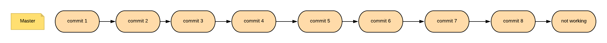
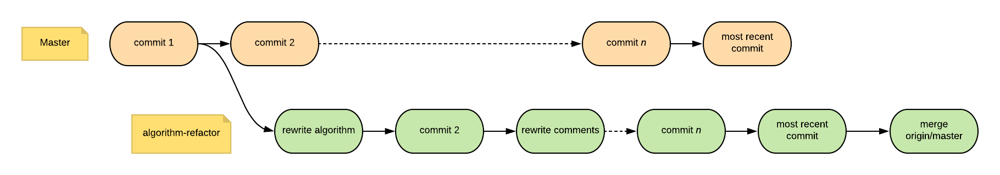

# Prometheus Workshop

https://dgoldstein1.github.io/git-debugging-workshop/

This repo is a hands-on tutorial to become troubleshooting and debugging with `git`. It consists of:

1. [Hands On Learning](#hands-on-learning)
	1. [Reverting A Pull Request](#reverting-a-pull-request)
	2. [Finding A Bad Commit](#finding-a-bad-commit)
	3. [Updating A Stale Branch](#updating-a-stale-branch)
1. [Authors](#authors)
1. [License](#license)


## Hands On Learning

To get the deepest understanding of `git` and the tools it offers, we need to learn at the command line. Below are a few common situations where we have run outside the usual git flow process and we need to dig into our commit histories. Let's begin!

### Reverting A Pull Request

We've all been here. It's late at night and we have a demo early in the morning. You finally solve that issue that's been driving your team crazy. You push up your branch and create a PR. You message your teammate and she quickly merges in your code just before midnight. Everyone gets a good night's sleep.

Your code haunts you in your dream that night and you realize you've made a fatal flaw in your code. You're able to get to the computer before the demo, but only have an hour and you know you can't fix the bug in that time. You know you want to 'undo' last night's merge, but how?!

You go to the [github-documentation](https://help.github.com/en/articles/reverting-a-pull-request) but you realized that you can't just press the 'undo' button because there have been commits since your merge last night.

Let's start by cloning this example locally:

```sh
git clone git@github.com:dgoldstein1/revert-pr.git
```

The current tree looks like this:


Take a second and think. What do we want our *end result* to look like? Simply removing our bad commit and midnight-pr branch from the tree might look enticing, e.g.:


However, this is not good git. Instead of covering up bad mistakes, it's important we signal that we identified an issue temporarily solved it by reverting our code. That gives us a readable and fluid commit history. Crucially, `git` functions as a linked graph; *it almost always better to add commits rather than inserting or deleting commits.* The ideal git graph after reverting our pull request should look like this:


Let's take a moment to think of what we want to do before we get to code. Remember we're not *fixing* the problem, we want to revert things back to what we had before we merged our midnight PR (the commit `wrote out main function`). Take a few minutes to play around with this on your own. Try to get your git tree to look like our ideal solution above. Note that you can visualize the current git tree with `git log --graph`.

When you're ready follow along with the below steps to revert our code:

 - checkout a new branch `revert midnight PR` off of `origin/master`

 ```sh
$ git checkout -b revert-midnight-pr origin/master
 ```

 - make the files in git equal the commit `wrote out main function`

```sh
# use 'git log' to get the commit hash of "wrote out main function" commit
$ git log --grep "wrote out main function"
commit 3c9977cd21601a09e51f3d8843d81f3303ba6b0e
Author: David Goldstein <david.goldstein@deciphernow.com>
Date:   Wed May 1 14:12:42 2019 -0400

    wrote out main function
# reset all files in repository to that commit, note the '.'
$ git checkout 3c9977cd21601a09e51f3d8843d81f3303ba6b0e .
# make a new commit 
$ git commit -m "revert midnight pr"
```

 - merge these changes into `master` in a new commit

```sh
$ git checkout master
# merge locally so we don't mess up the remote repository
$ git merge revert-midnight-pr
```
At this point you should see that master has a new commit from the merge which reverts the midnight PR.
```sh
$ git log --graph
...
* commit 538b4a637ec8f2959eb8af76705757cee105d922 (HEAD -> master, revert-midnight-pr)
| Author: David Goldstein <david.goldstein@deciphernow.com>
| Date:   Wed May 1 15:12:27 2019 -0400
| 
|     revert midnight pr
| 
* commit bbb2841d7d435e5c2ef509094e30c84215c5e710 (origin/master)
| Author: David Goldstein <david.goldstein@deciphernow.com>
| Date:   Wed May 1 14:46:00 2019 -0400
| 
|     early morning commit
|   
*   commit bb2a1a334f603608f33e9d4cd721e2077e44cb39
|\  Merge: 3c9977c af18d8c
| | Author: David Goldstein <dgoldstein01@gmail.com>
| | Date:   Wed May 1 14:38:17 2019 -0400
| | 
| |     Merge pull request #2 from dgoldstein1/midnight-pr
| |     
| |     Midnight pr

...
```

### Finding A Bad Commit

Possibly the most common and frustrating part of a developer's job is discovering a bug but being unable to trace its origins. `git` is a great starting place for this search as it allows us to quickly filter through a range of commits to find one which may be causing problems.

Let's turn to a new scenario. Let's say you're developing a new algorithm for an application. You know the algorithm has worked recently, but just yesterday somebody mentioned to you they're getting incorrect results. Let's checkout our code:

```sh
git clone git@github.com:dgoldstein1/find-bad-commit.git 
```

Our current commit history looks like this:



We have several commits and don't know when or where our code stopped working correctly. All we know is that the final commit `not-working` is not working correctly.

Let's see what our algorithm does:

```sh
$ make
gcc -o problem_14.o problem_14.c -Wall -std=c99 -w -lm # compile object
./problem_14.o # run code
922524 # output
rm -f problem_14.o # delete compiled object
```

As we can see, our algorithm outputs a number from pre-determined inputs. If we look at out code in `problem_14.c` we can see that we're answering the question in `problem_14.txt`, finds the longest [Collatz Sequence](https://en.wikipedia.org/wiki/Collatz_conjecture) for numbers less than 1 million.

From wikipedia we can see that the answer should be 837,799, which has 524 steps. However, the current version of our algorithm is returning 922,524, which is incorrect! Let's checkout our first commit to see if it's working there.

```sh
$ git log --grep "commit 1"
commit 725f4c6f5ab3a9226f45074608afe39a97066ad3 (HEAD -> master)
Author: David Goldstein <david.goldstein@deciphernow.com>
Date:   Wed May 1 16:09:46 2019 -0400

    commit 1

$ git checkout 725f4c6f5ab3a9226f45074608afe39a97066ad3
$ make 
gcc -o problem_14.o problem_14.c -Wall -std=c99 -w -lm
./problem_14.o
837799
rm -f problem_14.o
```

The answer is correct, we can see that `commit 1` is working. Now we know that our bug was created somewhere in between `commit 1` and the commit `not working`. Think for a second: how would you solve this?

`git bisect` is a nice tool for piecing apart ranges of commits. It uses a binary search to locate the commit which first created your bug. Let's configure git to start bisecting:


```sh
$ git checkout master
$ git bisect start #initialize 'bisect' mode
$ git bisect bad # commit 'not working' is bad
$ git bisect good 725f4c6f5ab3a9226f45074608afe39a97066ad3 # the "commit 1" is good
8afe39a97066ad3
Bisecting: 3 revisions left to test after this (roughly 2 steps)
[5c47d268c695c6db6669bac7f7e1ee48aaa36e0c] commit 5
```

We're now in 'bisect' mode. We start on `commit 5` (`5c47d268c695c6db6669bac7f7e1ee48aaa36e0c`). Note that because the number of commits is known, and the search is binary, we can pre-compute the number of steps needed (i.e. `steps = ciel(ln(#commit))`) If you run `git log`, you should see that there are 5 commits between you and the initial commit. Let's continue our bisecting.

If we run our algorithm on `commit 5` with the command `make` we can see that we still don't get the right answer (837799), so let's mark "commit 5" as bad:

```sh
$ git bisect bad
Bisecting: 0 revisions left to test after this (roughly 1 step)
[d5ba6868503d2227dc817e42f47a346599b101bd] commit 3
```

Now it has taken us to "commit 3". Run `make` again. We see that we get the correct result this time (837799). Let's mark commit 3 as good:

```sh
$ git bisect good
Bisecting: 0 revisions left to test after this (roughly 0 steps)
[2f5b521253d737843b99d8096e7f7cec9e3ef437] commit 4
```

We can see we have 0 steps left so we're on our last step! Run `make` again and then `git bisect good / bad` accordingly. You should get the output:

```sh
2f5b521253d737843b99d8096e7f7cec9e3ef437 is the first bad commit
commit 2f5b521253d737843b99d8096e7f7cec9e3ef437
Author: David Goldstein <david.goldstein@deciphernow.com>
Date:   Wed May 1 16:30:29 2019 -0400

    commit 4

:100644 100644 2caec9398a44559bdb4c93007e179856f4df5331 aa30565873cf88561b53251cbf9625e63bb424b9 M	problem_14.c
```

This tells us that `commit 4` is the first bad commit and where our bug might originate. Let's look at the difference between `commit 4` and the previous commit:

```sh
$ git diff HEAD~1 # we're currently on "commit 4", HEAD~1 refers to 1 commit behind
...
-       for (int i = 1000000; i > 500000; --i) {
+       for (int i = 1000000; i > 500000; i = i - 4) {
```

We see that the only difference is we decrement our loop by 4 instead of 1. That seems like it could be an issue. On your own, checkout master an change the decrementing interval back to 1. Does it work? If so than this is our only bug, if not, there could be other bugs causing issues and we should bisect on a different range of commits.

One nice feature of `git bisect` is that it can be automated. Here's an automated example of the sequence we just went through:

```sh
$ echo '#!/bin/bash
> 
> make problem_14
> ./problem_14.o | grep -q "837799"' >> ../bisect_run.sh # create a script to run on each bisect
$ chmod +x ../bisect_run.sh # give it permission
$ git bisect reset # leave' bisect' mode
$ git bisect start #initialize 'bisect' mode
$ git bisect bad # commit 'not working' is bad
$ git bisect good 725f4c6f5ab3a9226f45074608afe39a97066ad3 # the "commit 1" is 
$ git bisect run ../bisect_run.sh
running ../bisect_run.sh
gcc -o problem_14.o problem_14.c -Wall -std=c99 -w -lm
/home/david/dev/personal/find-bad-commit
Bisecting: 1 revision left to test after this (roughly 1 step)
[d5ba6868503d2227dc817e42f47a346599b101bd] commit 3
running ../bisect_run.sh
gcc -o problem_14.o problem_14.c -Wall -std=c99 -w -lm
/home/david/dev/personal/find-bad-commit
Bisecting: 0 revisions left to test after this (roughly 0 steps)
[2f5b521253d737843b99d8096e7f7cec9e3ef437] commit 4
running ../bisect_run.sh
gcc -o problem_14.o problem_14.c -Wall -std=c99 -w -lm
/home/david/dev/personal/find-bad-commit
2f5b521253d737843b99d8096e7f7cec9e3ef437 is the first bad commit
commit 2f5b521253d737843b99d8096e7f7cec9e3ef437
Author: David Goldstein <david.goldstein@deciphernow.com>
Date:   Wed May 1 16:30:29 2019 -0400

    commit 4

:100644 100644 2caec9398a44559bdb4c93007e179856f4df5331 aa30565873cf88561b53251cbf9625e63bb424b9 M	problem_14.c
bisect run success

```

We end up with the same result-- that the bug originates from `commit 4`. As you can see, `git bisect run` saves more and more time as the number of commits increases. For instance, debugging 1000 commits takes only 7 maximum steps with git bisect (`ciel(ln(1000)) = 7`)

### Updating a Stale Branch

Let's turn to a new scenario. Say you're working on a new algorithm refactor but you get transferred to another project for a few months to help with a big release. When you come back, the code you were working in has completely changed and your branch is stale! This is now the git tree:


Take a minute to look through this diagram and think about how you would update your branch in the *wild*. 

The two commands git gives us to update branches `git rebase` and `git merge`. Both of these approaches will allow us to update our `algorithm-refactor` branch. Let's try both of these approaches to see the costs and benefits of each.

Start by cloning the repository:

```sh
TODO: CLONE REPO
```

#### Merge

According to `git --help`, the `git merge` "Join[s] two or more development histories together." In terms of our scenario, merging master into our branch would make a new commit with all the changes necessary to incorporate changes from master so that merging into master will be clean (i.e. three way merge):




#### Rebase

## Authors

* **David Goldstein** - [davidcharlesgoldstein.com](http://www.davidcharlesgoldstein.com/?git-debugging-workshop)

## License

This project is licensed under the MIT License - see the [LICENSE.md](LICENSE.md) file for details

	
